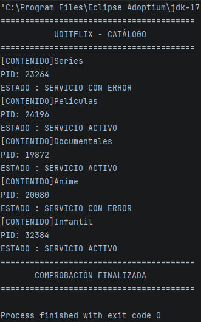

# Reto 1 · Monitor del catálogo de UDITflix

**Módulo:** 0490 · Programación de Servicios y Procesos  
**Autor/a:** Nolan Martínez Gómez
**Reto:** ☑ Reto B (contenidos)  
**Tecnología:** Java + `ProcessBuilder` (procesos del sistema operativo)  
**RA vinculado:** RA1 · Programación de aplicaciones compuestas por varios procesos  

> 💡 **Cómo usar este README:** no es un trámite que se rellena al final. Es tu cuaderno de pensamiento durante el reto. Las secciones marcadas con 🧠 sirven para que **pienses sobre cómo estás pensando**. Si las rellenas de golpe en el último minuto, pierden todo su valor (y se nota).

---

## 📺 Qué es esta app

Un programa de consola que simula el monitor interno de UDITflix: comprueba si cada elemento del catálogo de contenidos está **ACTIVO** o **CAÍDO**. Para cada uno lanza un proceso externo (`ping`), muestra su PID, lee lo que responde y espera a que termine.

---

## 🧠 Antes de empezar: planifico (5 min, sin tocar el teclado)

1. **Con mis palabras, ¿qué me pide el reto?**
   Crear un programa en Java que verifique automáticamente la disponibilidad del catálogo de UDITflix mediante el comando `ping` del sistema operativo, procesando y mostrando la información (PID, respuesta y estado del servicio) de forma secuencial mediante un bucle.

2. **¿Qué parte de la píldora de clase creo que voy a reutilizar?**
   La lógica para crear un proceso con `ProcessBuilder`, capturar su PID con `.pid()`, leer su salida estándar utilizando `BufferedReader` con `getInputStream()`, y obtener su código de salida con `waitFor()`.

3. **¿Qué parte me da más respeto o no sé por dónde empezar?**
   Gestionar los argumentos del comando `ping` según el sistema operativo (diferenciar entre Windows y Unix/Linux/Mac) y asegurar la lectura continua del flujo de datos sin bloqueos.

4. **Mi plan en 3-4 pasos, en orden:**
   1. Declarar una matriz `String[][]` con los nombres de los contenidos y sus IP/Dominios de prueba.
   2. Iterar la matriz con un bucle `for` y construir el comando `ping` correspondiente según el sistema.
   3. Ejecutar el proceso con `ProcessBuilder`, capturar su PID y leer su salida línea a línea.
   4. Evaluar el código de retorno con `waitFor()` para imprimir si el elemento está **ACTIVO** (código 0) o **CAÍDO** (código distinto de 0).

5. **Predicción:** si todas las direcciones fueran `127.0.0.1`, ¿qué estado saldría en los cinco elementos? ¿Y si todas fueran direcciones inexistentes?
   - Si todas son `127.0.0.1` (localhost), todos saldrán **ACTIVO** porque la máquina responde inmediatamente a su propia dirección.
   - Si son inexistentes, saldrán **CAÍDO** tras agotar el tiempo de espera (timeout), devolviendo un código de error distinto de 0.

---

## 🎯 Objetivo del reto

Partir de lo aprendido en la píldora (lanzar **un** proceso) y dar el salto a **gestionar varios procesos con una estructura de datos y un bucle**, aplicando: creación de procesos con `ProcessBuilder`, identificación por PID, lectura de su salida, espera con `waitFor()` e interpretación de su resultado.

---

## 🛠️ Componentes y conceptos utilizados

| Componente / concepto | Para qué se usa en esta app | Con mis palabras |
|---|---|---|
| `ProcessBuilder` | Prepara la orden (`ping ...`) que se enviará al sistema operativo | Es el "configurador" del comando antes de lanzarlo al sistema. |
| `start()` | Lanza de verdad el proceso; devuelve un `Process` sin esperarle | Es el botón de encendido que ejecuta el comando en segundo plano. |
| `Process` | Objeto con el que controlo el proceso que ya está en marcha | Es la representación del programa externo dentro del código Java. |
| `pid()` | Número que identifica al proceso en el sistema operativo | Es el "DNI" único que le asigna el sistema operativo al proceso. |
| `getInputStream()` | Canal por el que **recibo** lo que escribe el proceso | La vía por la que mi programa "escucha" lo que imprime el `ping`. |
| `BufferedReader` + `readLine()` | Leer esa salida línea a línea | La herramienta para procesar el texto recibido de forma cómoda y estructurada. |
| `waitFor()` | Bloquea mi programa hasta que el proceso termina y devuelve su código de salida | Pausa Java hasta que el `ping` finalice y me dice si salió bien (0) o mal (!=0). |
| Matriz `String[][]` | Guarda, para cada elemento, su nombre y su dirección de comprobación | La tabla de datos donde almaceno qué quiero comprobar y dónde buscarlo. |
| Bucle `for` | Repite el mismo proceso de comprobación para cada fila de la matriz | El automatizador que pasa por todo el catálogo uno a uno. |

**¿Qué contiene cada posición de mi matriz?**

matriz[i][0] → Nombre del contenido del catálogo (ej: "UDITflix Core Server", "Servidor de Contenidos 1")
matriz[i][1] → Dirección IP o dominio asociado para comprobar la conectividad (ej: "127.0.0.1", "google.com")

---

## 🚀 Cómo ejecutar el proyecto

1. Clonar o abrir el proyecto en IntelliJ IDEA.
2. Esperar a que indexe el proyecto.
3. Ejecutar (▶) la clase principal.

> ⚠️ El comando `ping` usa `-n` en Windows y `-c` en Linux/Mac para el número de intentos. Indica aquí con qué sistema lo has probado: **Windows / macOS / Linux** *Windows*.

---

## 🔍 Mientras programo: mi diario de decisiones

| Qué intentaba | Qué pasó realmente | Qué hice / qué aprendí |
|---|---|---|
| Ejecutar el comando `ping` directamente en Windows | El comando fallaba por sintaxis de parámetros (`-c` vs `-n`). | Adapté los argumentos del `ProcessBuilder` verificando la propiedad `System.getProperty("os.name")`. |
| Leer la salida del proceso | La consola no mostraba nada o se quedaba congelada. | Entendí que debía envolver `getInputStream()` en un `BufferedReader` e iterar mientras `readLine() != null`. |
| Determinar el estado ACTIVO/CAÍDO | Salía siempre ACTIVO independientemente de la IP. | Me di cuenta de que evaluaba si el proceso se iniciaba y no el valor devuelto por `waitFor()`. |

**Mi pregunta-brújula cuando me bloqueo:**
1. ¿Qué espero que haga esta línea?
2. ¿Qué está haciendo realmente? (imprimo valores para comprobarlo)
3. ¿En qué punto exacto se separan las dos respuestas?

---

## 🧭 De la píldora al reto: cómo di el salto

- **¿Qué tenía la píldora que ya no me sirve tal cual?**
  El código estático para un único comando fijado a mano (hardcodeado).
- **¿Qué he tenido que añadir para repetirlo cinco veces? ¿Por qué esa estructura y no otra?**
  Una matriz para estructurar la información de catálogo/IP y un bucle `for` para iterarla. Esta estructura permite separar los datos de la lógica de ejecución de procesos.
- **¿Qué parte del código es exactamente igual en todas las vueltas del bucle y qué parte cambia?**
  - **Igual:** La instanciación de `ProcessBuilder`, la lectura del flujo con `BufferedReader` y la llamada a `waitFor()`.
  - **Cambia:** El objetivo de la comprobación (el nombre del elemento y la dirección IP elegida en cada iteración).
- **Si mañana UDITflix tuviera 500 elementos en lugar de 5, ¿qué tendría que cambiar en mi código?**
  Únicamente la matriz de entrada (o leer los elementos desde una base de datos/archivo JSON). El bucle procesaría los 500 elementos automáticamente sin modificar la lógica de comprobación.

---

## 🧠 Qué he aprendido

- **Hilo vs. proceso:** Un proceso es una instancia de un programa en ejecución con su propio espacio de memoria independiente administrado por el SO; un hilo es una unidad mínima de ejecución dentro de un mismo proceso que comparte memoria con otros hilos.
- **PID:** Es el identificador único del proceso asignado por el Kernel del SO. Cambia en cada ejecución porque el SO asigna dinámicamente los PIDs libres disponibles en ese instante.
- **`start()` vs. `waitFor()`:** `start()` inicia la ejecución de un proceso de forma asíncrona y continúa el flujo de nuestro programa Java. `waitFor()` suspende la ejecución del hilo principal de Java de forma síncrona hasta que el proceso hijo finaliza.
- **Código de salida:** Un valor `0` indica por convención que el comando terminó con éxito. Un valor distinto de `0` (ej: `1`, `2`) indica un error en la ejecución o fallo en el comando (ej: host inalcanzable).
- **Lo que mi programa decide sobre ACTIVO / CAÍDO se basa en...** El código de salida del comando `ping`. *¿Es fiable?* En la mayoría de casos sí, pero puede fallar o dar falsos negativos si un firewall bloquea las peticiones ICMP (ping) aunque el servidor web esté funcionando correctamente.

---

## 🐞 Dificultades y cómo las resolví

- **Dificultad 1:**
  - **Qué síntoma vi:** En Windows el programa no terminaba la comprobación o devolvía error de parámetros.
  - **Cuál era la causa real:** Estaba pasando el parámetro `-c 1` que pertenece a entornos Unix/Linux, en lugar de `-n 1` que exige Windows.
  - **Cómo la encontré:** Imprimiendo en consola el comando completo asignado al `ProcessBuilder` y probándolo manualmente en la terminal.
  - **Cómo evitaré que me vuelva a pasar:** Comprobando siempre el SO mediante `System.getProperty("os.name")` antes de configurar comandos nativos.

---

## 🪞 Autoevaluación

| Puedo explicar a un compañero... | 🔴 No | 🟡 Más o menos | 🟢 Sí |
|---|:-:|:-:|:-:|
| Qué hace `ProcessBuilder` | ☐ | ☐ | ☒ |
| Qué hace `start()` y por qué no espera | ☐ | ☐ | ☒ |
| Qué representa el PID | ☐ | ☐ | ☒ |
| Para qué sirve `getInputStream()` | ☐ | ☐ | ☒ |
| Qué hace `waitFor()` y qué devuelve | ☐ | ☐ | ☒ |
| Qué hay en cada posición de la matriz | ☐ | ☐ | ☒ |
| Qué hace el `for` en mi programa | ☐ | ☐ | ☒ |

**Mi predicción del principio, ¿acerté?**
Sí, las direcciones `127.0.0.1` respondieron de forma inmediata devolviendo `0` (ACTIVO). Las direcciones erróneas/inexistentes devolvieron un código distinto de `0` tras agotar el tiempo de espera, marcándose correctamente como CAÍDO.

**Lo que haría diferente si empezara de nuevo:**
Implementaría ejecuciones multihilo o asíncronas para que no tenga que esperar a que un `ping` falle totalmente antes de comprobar el siguiente elemento del catálogo.

**Lo que todavía no tengo claro y quiero preguntar en clase:**
¿Cómo se gestiona adecuadamente la redirección de `getErrorStream()` en caso de que el proceso escriba en la salida de error en lugar de la estándar?

---

## 🤝 Declaración de autoría

Este reto no permite herramientas de generación de código mediante IA. Consulté únicamente: la píldora de clase, mis apuntes, la documentación de Java e IntelliJ IDEA.

☒ Confirmo que el código es mío y que puedo explicarlo línea a línea.

---

## 📂 Estructura del proyecto

src/main/java/org/example/
└── Main.java                → Clase principal (monitor del catálogo de UDITflix)
README.md                    → Documentación del reto

---

## 🔗 Enlace

- **GitHub:** https://github.com/MrSonbi/psp_udit/tree/main/PSP-RETO-1-B-Monitor-del-catalogo-de-UDITflix